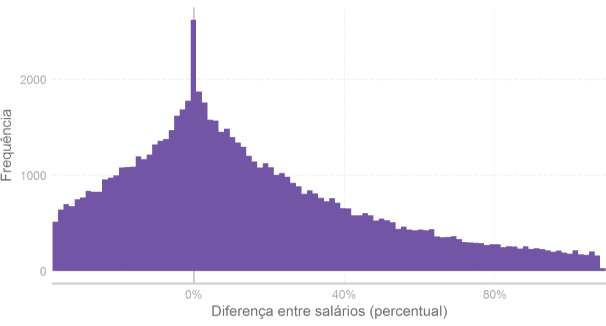
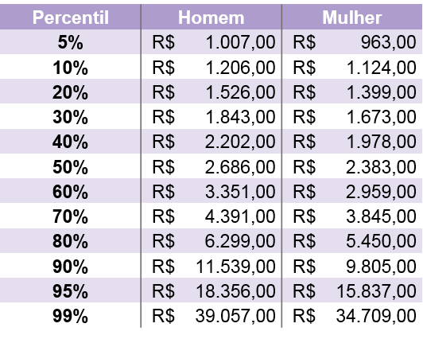
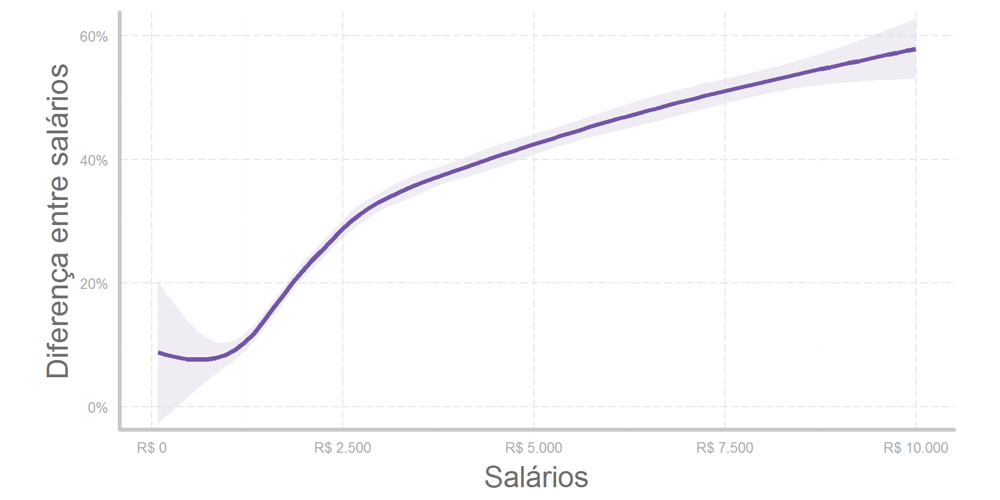
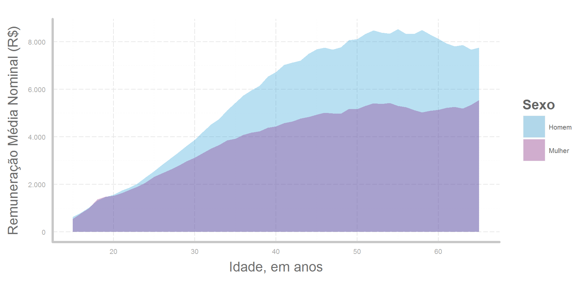
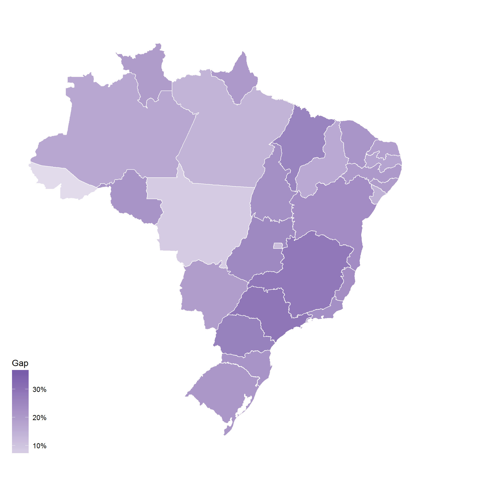

# DIFERENÇA DE SALÁRIOS NO BRASIL

*Este artigo foi publicado no [LinkedIn]() no dia 18/01/2018  
*This article was published in English on [LinkedIn]() on 01/18/2018

## Existe discriminação no pagamento de funcionários?

Nos últimos anos a discussão em torno da diferença de salários entre homens e mulheres provocou uma série de mudanças legais e na percepção pública sobre determinadas empresas. Na Alemanha, por exemplo, [é obrigatória a divulgação de estatísticas salariais](https://www.thelocal.de/20180112/germany-tackles-gender-pay-gap) (sob certas condições e com ressalvas). A Islândia, por sua vez, [quer acabar com a diferença de salários de homens e mulheres em 5 anos](https://www.nbcnews.com/news/world/iceland-wants-end-gender-pay-gap-5-years-can-u-n837046).

O debate acalorado em torno do tema tem duas visões básicas: ou existe, ou é um mito. Cada lado tem os seus argumentos, e normalmente os que acreditam na diferença de salários trazem estatísticas que são rejeitadas pelo lado que discorda.

E no Brasil? Como os salários se comportam? 

## Os dados

Para calcular e visualizar com a maior precisão possível se existe essa diferença por aqui, precisamos utilizar os dados da [Relação Anual de Informações Sociais (RAIS)](http://trabalho.gov.br/rais), produzida pelo Ministério do Trabalho e Emprego com as informações de todas as empresas registradas no país.

Para este trabalho utilizei o máximo de informações possíveis para tornar indivíduos comparáveis: Ocupação, atividade econômica, horas contratadas, escolaridade, natureza jurídica do estabelecimento, o tamanho da empresa, o tempo na empresa, e o tipo de admissão e de vínculo. 

Para mais informações sobre o tratamento dos dados e os cálculos realizados, veja no meu [GitHub](https://github.com/joaoapb/wage_gap_brazil).

## Diferenças de salário

Neste breve trabalho, consideramos a diferença de salário como sendo a diferença percentual entre os salários de homens e mulheres. No Gráfico 1 abaixo vemos a distribuição dessa diferença percentual nos grupos descritos acima.

### **Gráfico 1 - Diferença percentual entre salários**

Na distribuição apresentada acima, valores abaixo de 0 significam que mulheres ganham mais que os homens, enquanto que valores positivos significam um salário maior para os homens. Cada barra mostra quantos casos puderam ser identificados de diferença salarial ao longo do eixo horizontal.

Na Tabela 1 está a distribuição dos salários por sexo. Através dela, fica claro que há diferença nos níveis de salário. Por exemplo, enquanto o salário de 50% dos homens está acima de R$ 2.686,00, apenas 44,3% das mulheres estão nessa faixa de rendimento.

### **Tabela 1 - Distribuição por salário**

*Fonte: Elaboração própria, com base na RAIS/MTE 2016*

No Gráfico 1 abaixo, a diferença média foi estimada localmente através do método de [Modelos Aditivos Generalizados](https://multithreaded.stitchfix.com/blog/2015/07/30/gam/) (GAM na sigla em inglês), e a faixa em lilás claro representa a variabilidade naquele ponto. Salários abaixo do salário mínimo ou acima de R\$ 10.000,00 apresentam grande dispersão, daí produzindo um resultado menos significante. Como, pela Tabela 1, cerca de 90% da população tem salários abaixo de R\$ 10.000,00, podemos cortar quem está acima e entender melhor.

### **Gráfico 2 - Diferença média por salário**

Existe um salto na diferença entre salários até os R\$ 2.500,00 reais, e após a diferença cresce a um ritmo menor. Essa diferença, que pode ser interpretada como o quanto um homem ganha a mais que uma mulher, chega a 60% nos salários mais altos.

Como o salário (normalmente) aumenta com a idade, como resultado dos anos de experiência e da educação, precisamos ver como os dois se comportam para ambos os sexos.

### **Gráfico 3 - Diferença média por idade**

O Gráfico 3 acima mostra a diferença entre os salários, começando por volta dos 25 anos de idade, e voltando a diminuir - ainda que ligeiramente - a partir dos 55 anos. 

Para terminar essa breve análise da diferença entre salários de homens e mulheres no Brasil, precisamos ver um mapa!

### **Mapa 1 - Diferença média por Estado**

Os estados com maior diferença nos salários sçao também alguns dos mais ricos. São Paulo, Minas Gerais, e Paraná lideram o ranking dos mais desiguais com mais de 34% de diferença, enquanto que Acre, Mato Grosso e o Distrito Federal se destacam "positivamente" com uma diferença de menos de 15,3%.

Ainda temos um bom caminho a percorrer na redução da diferença entre salários.

A análise é simples, mas já mostra bastante coisa! Espero poder contribuir mais para as discussões sobre as desigualdades do nosso país, e espero os comentários e sugestões!
